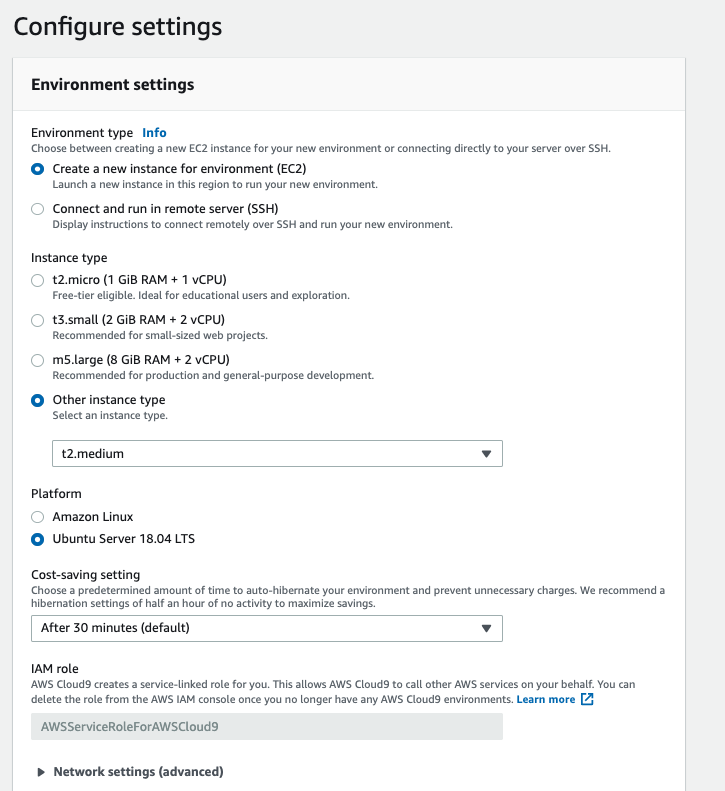

# 01 - Setup e Configuração de ambiente


 1. Abra o console da AWS e va para o serviço `Cloud 9`.
   
1. garanta que a região que esta utilizando é `us-east-1/ Norte da Virgínia`. Você consegue ver isso no canto superior direiro da tela.
    
 2. Clique em `create environment`.
 3. Coloque o nome `lab-fiap` e avance.
 
 5. Deixe as configurações como na imagem a seguir. Se atente ao tipo da maquina que deve ser t2.medium:

 6. Caso os parametros estejam como na imagem a seguir clique em `Create Environment`
   
 7. A criação do ambiente pode levar alguns minutos.

 8. Após a criação clique em `abrir IDE`, caso o IDE não tenha aberto automaticamente.
   
9. Para os próximos comandos utilize o console bash que fica no canto inferior do seu IDE.
   
10. Execute o comando `npm install -g serverless` para instalar o serverless framework.
    
11. Execute o comando `sudo apt  install jq -y` para instalar o software que irá nos ajudar a ler e manipular Jsons no terminal
12. Execute o comando `git clone https://github.com/vamperst/bootcamp-data-engineering.git` para clonar o repositório com os exercicios.
13. Execute o comando `cd bootcamp-data-engineering/` para entrar na pasta criada pelo git
14. Execute o comando `cd 01-setup-e-configuracao/` para entrar na pasta com os scripts de Configuração.
15. Precisamos aumentar o tamanho do volume(HD) do cloud9. Para isso execute o comando  `sh resize.sh`
   
16. Para utilizar o SDK em python da AWS instale com o comando `pip3 install boto3`
17. Iremos utilizar um dataset do kaggle para fazer o bootcamp, instale o sdk da api para conseguir fazer o download via terminal `pip install kaggle`
18. Em outra aba do navegador entre na sua conta do kaggle - [login](https://www.kaggle.com/city-of-seattle/seattle-library-collection-inventory)
19. No canto direito superior clique na sua foto e clique em 'My account':
    
    
20. Desça a tela até a opção API e clique em 'Create new API Token'
    
21. Um arquivo, kaggle.json ,será baixado para sua maquina, abra o arquivo e copie o conteúdo.
22. De volta ao terminal do Cloud9, execute o comando `mkdir -p ~/.kaggle`
23. Execute o comando abaixo copiando o conteudo do kaggle.json que baixou e colocando entre aspas simples como na imagem:
    ```
      echo 'SEU JSON USER COM TOKEN' >> ~/.kaggle/kaggle.json
    ```
    
24. Execute o comando `chmod 600 ~/.kaggle/kaggle.json` para colcoar a permissão certa no token
25. Vamos criar o lugar onde ficarão os dados na maquina. Para isso crie a pasta com o comando ` mkdir ~/environment/seattle-library-collection-inventory` e entre nela `cd ~/environment/seattle-library-collection-inventory`
26. Vamos baixar o dataset na maquina com o comando `kaggle datasets download -d city-of-seattle/seattle-library-collection-inventory`
27. AO termino do download execute o comando `unzip seattle-library-collection-inventory.zip` para descompactar o conteúdo.
28. Apague o zip que baixou e já não é mais necessário com comando `rm seattle-library-collection-inventory.zip`

