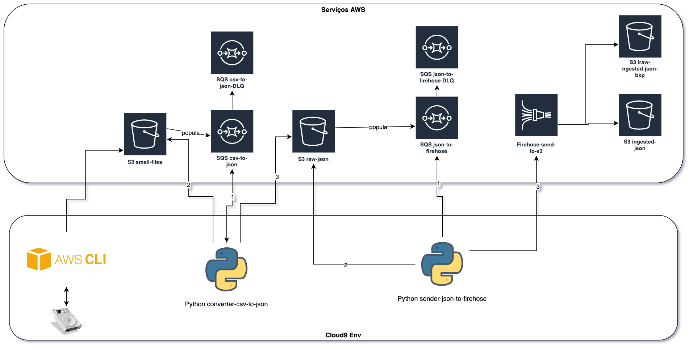
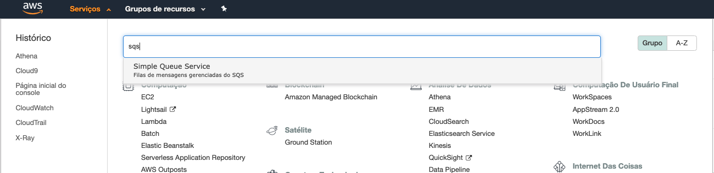
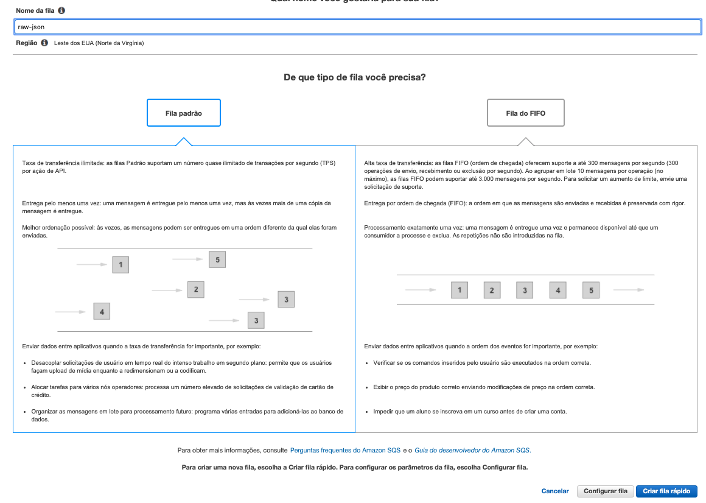
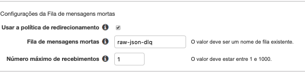
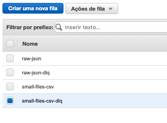
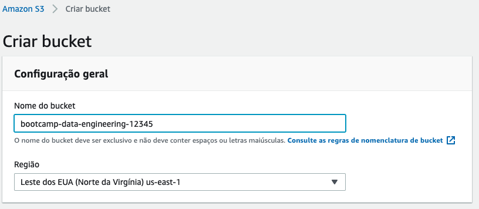
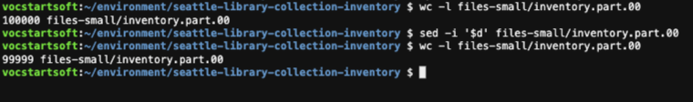

# 02 - Ingestão Manual

1. Primeiro vamos criar 4 filas no SQS, para isso abre o console e no canto esquerdo superior clique em `serviços`, digite `sqs` e selecione para abrir.
   
2. Inicialmente vamos criar as 2 filas DLQ: `raw-json-dlq` e `small-files-csv-dlq`. 'Clique em criar uma nova fila', apenas coloque os nomes, mantenha as opções padrão e clique em 'Criar fila rápido'.
   
3. Agora vamos as filas principais: `raw-json` e `small-files-csv`. Clique novamente em 'Clique em criar uma nova fila' coloque o nome e clique em configurar fila. Em `Configurações da Fila de mensagens mortas` deixe como na imagem. Lembrando que cada fila tem sua respectiva DLQ. E clique em `Criar fila`
   
4. Ao final devem haver 4 filas:
   
5. Para não precisar lidar com um arquivo muito grande vamos dividir em varias partes, para tal vá ao terminal do cloud9.
6. Entre na pasta do dataset com o comando `cd ~/environment/seattle-library-collection-inventory/`
7. Crie a pasta para os arquivos menores com o comando `mkdir files-small`
8. Vamos criar arquivos de 100.000 linhas cada com o comando`split -d -l 100000 library-collection-inventory.csv files-small/inventory.part.` 
9. Pode ser que o comando demore um pouco para executar
10. Enquanto o código executa vamos criar o bucket que será utilizado no bootcamp. Para isso vá ao console do S3.
11. No canto supeiror direito clique em `Criar bucket`
12. Os nomes no S3 são unicos em toda a AWS não somente sua conta, vamos nomear seu bucket como `bootcamp-data-engineering-<SEU RM>` e clique em criar bucket
    
13. Devolta ao terminal do CLoud9, agora vamos retirar o cabeçalho do primeiro arquivo para que não atrapalhe na ingestão. Para tal utilize o comando `sed -i '$d' files-small/inventory.part.00`
    
14. Agora é hora de colocar os arquivos no S3, para isso execute o comando: `aws s3 cp --recursive ~/environment/seattle-library-collection-inventory/files-small/ s3://bootcamp-data-engineering-<SEU RM>/files-small/`