# 03 - Ingestão por eventos

1. Primeiramente vamos configurar as filas para fazer a ingestão por eventos. Vá para o console do SQS.
2. Selecione a fila `small-files-csv` e clique em 'ações da fila' seguido de 'Configurar fila'. Certifique de que esta como na imagem:
   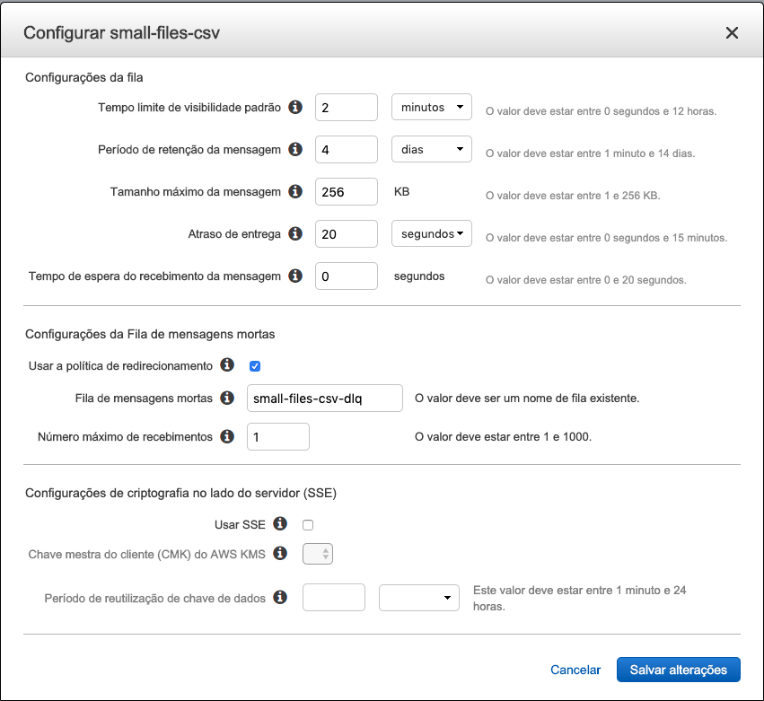
3. Agora vamos configurar a `raw-json`, certifique que esta como na imagem:
   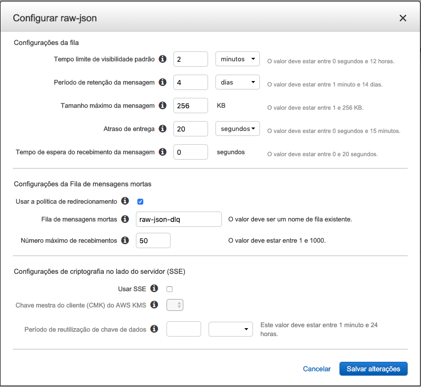
4. Foi necessário aumetar bastante o número máximo de recebimentos porque vamos limitar a quantidade de lambdas que consomem essa fila rodando em paralelo. Porem o SQS continua tentando entrega e recebendo a indispobilidade. Mas infos podem ser encontradas no artigo: [Lambda Concurrency Limits and SQS Triggers Don’t Mix Well](https://medium.com/@zaccharles/lambda-concurrency-limits-and-sqs-triggers-dont-mix-well-sometimes-eb23d90122e0)
5. Para fazer essa ingestão vamos precisar apagar todos os arquivos que estão no bucket que criou `bootcamp-data-engineering-<SEU RM>`.
6. Selecione todas as bastas do bucket, clique em 'ações' e 'excluir'.
   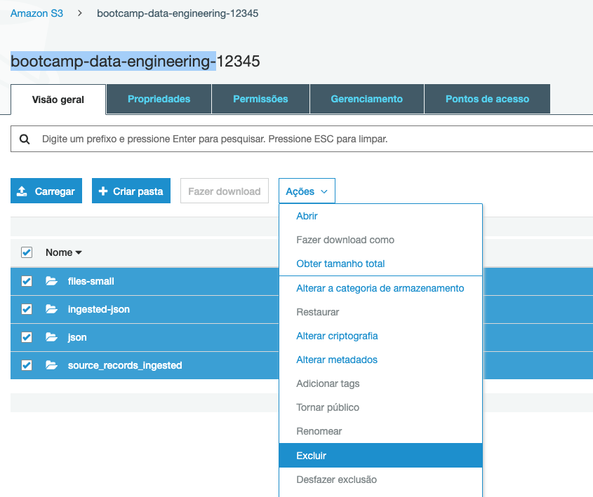
7. De volta ao Cloud9 execute o comando `cd ~/environment/bootcamp-data-engineering/03-ingestao-por-eventos/` para entrar na pasta com o código.
8. Execute o comando `cd lambda-put-in-sqs-from-s3` para entrar na pasta do primeiro lambda que vamos fazer deploy, o que fica monitorando novas entradas em pastas do S3 para colocar na fila do SQS.
9. No IDE vá para o arquivo `bootcamp-data-engineering/03-ingestao-por-eventos/lambda-put-in-sqs-from-s3/serverless.yml` e altere as 2 variáveis `bucket` colocando o nome do seu bucket. Na variável `urlSQS` da função 'small-files-csv' coloque o valor da URL da sua fila 'small-files-csv'. por ultimo na variável `urlSQS` da função 'raw-json' coloque o valor da URL da sua fila 'raw-json'.
    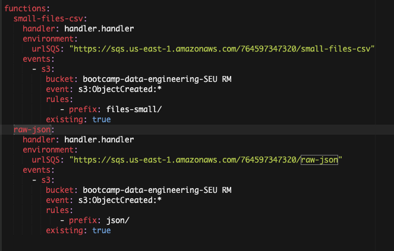
10. No terminal execute o comando `sls deploy`
    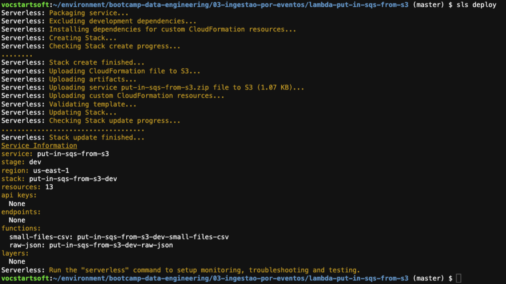
11. Se for ao painel do seu bucket no S3 irá notar que tem 2 gatilhos no bucket. Vá a raiz do bucket e selecione propriedades. 
    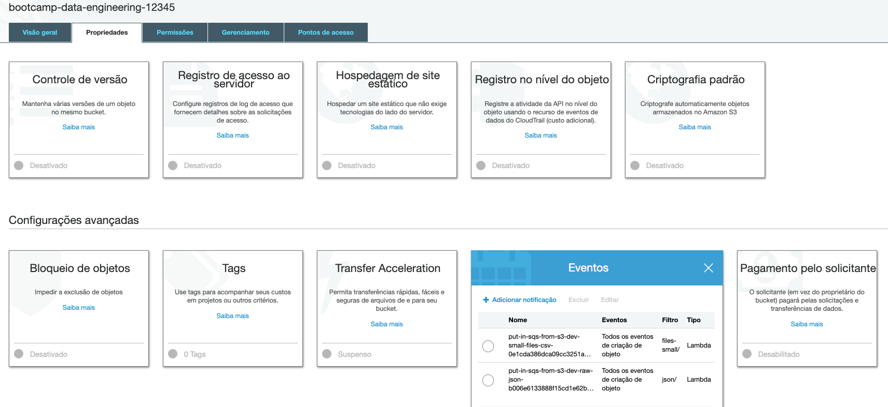
12. Voltando ao terminal do Cloud9, agora vamos fazer o deploy da função que irá ler da fila o csv e transformar em json. Execute o comando `cd ~/environment/bootcamp-data-engineering/03-ingestao-por-eventos/lambda-get-from-sqs-convert-to-json/` para entrar na pasta.
13. Recomendo que ao mudar de pasta feche todas as abas de arquivos abertas no IDE para não se confundir. Vários arquivos tem o mesmo nome.
14. Abra o arquivo `bootcamp-data-engineering/03-ingestao-por-eventos/lambda-get-from-sqs-convert-to-json/serverless.yml` no IDE. Altere a variável `arn` colocando o ARN da sua fila `small-files-csv`. No painel do SQS é a propriedade descrita abaixo da URL da fila.
    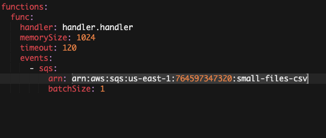
15. No terminal execute o comando `sls deploy`
    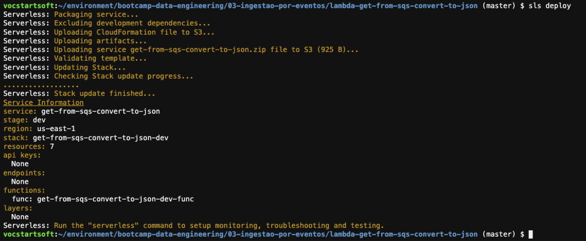
16. Se for ao painel do SQS verá que a fila `small-files-csv` tem um 'gatilho do lambda'
    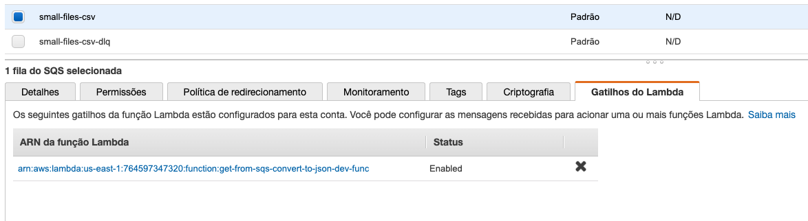
17. Para entrar na pasta do ultimo componente a fazer deploy para nossa arquiterura por eventos execute o comando `cd ~/environment/bootcamp-data-engineering/03-ingestao-por-eventos/lambda-get-from-sqs-to-firehose/` no terminal do cloud9.
18. Como feito no passa 14 altere a variável `arn` mas dessa vez colocando o ARN da fila `raw-json`.
    
    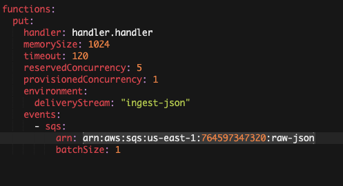
19. Execute o comando `sls dpeloy`
    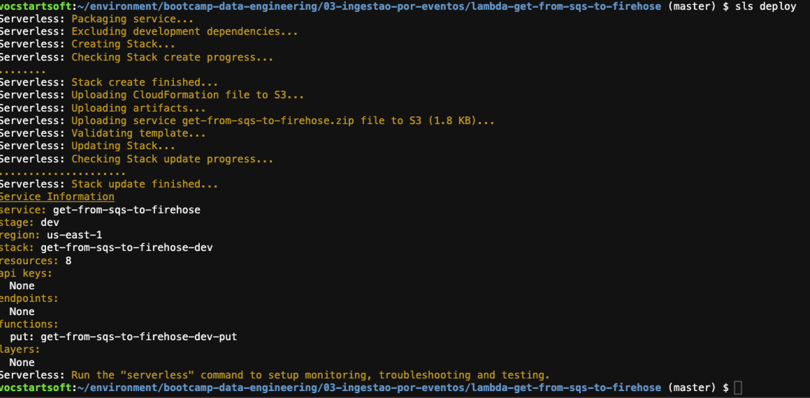
20. Se olhar o painel sqs da fila `raw-json` verá que tem um gatilho.
21. Garanta que nenhuma pasta existe no S3 proveniente de uma execução tardia do firehose. O bucket tem que estar vazio.
22. No terminal do Cloud9 execute o comando `aws s3 cp --recursive ~/environment/seattle-library-collection-inventory/files-small/ s3://bootcamp-data-engineering-<SEU RM>/files-small/` alterando o nome do bucket para o seu. Esse comando vai colocar os CSVs novamente no bucket e iniciar o processo.
23. Você poderá acompanhar o processo pelas filas do SQS. Primeiro na fila `small-files-csv` depois na `raw-json`
    
    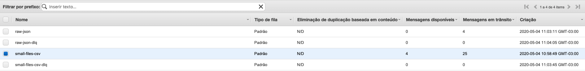
24. O processo irá demorar ao menos 10 minutos para terminar
25. Se for para o painel da função lambda `get-from-sqs-to-firehose-dev-put` clicar em 'Monitoramento' e após `Visualizar logs no CloudWatch` terá acesso aos logs do lambda enviando dados para o firehose.
26. Escolha um dos streams de logs e acompanhe o quando quiser o processamento.
    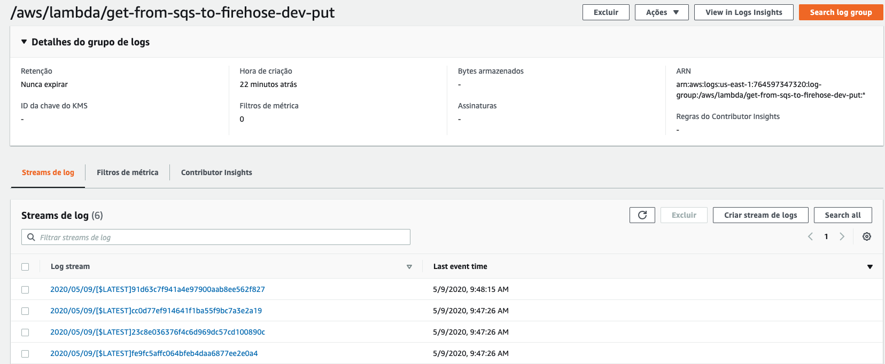

27. Após todas as filas zerarem espere 5 minutos pois é o tempo máximo que configuramos no firehose para fazer pacotes para o S3.
28. Navegue pelo S3 e veja os arquivos ingeridos.