# 04 - Leitura & transformação

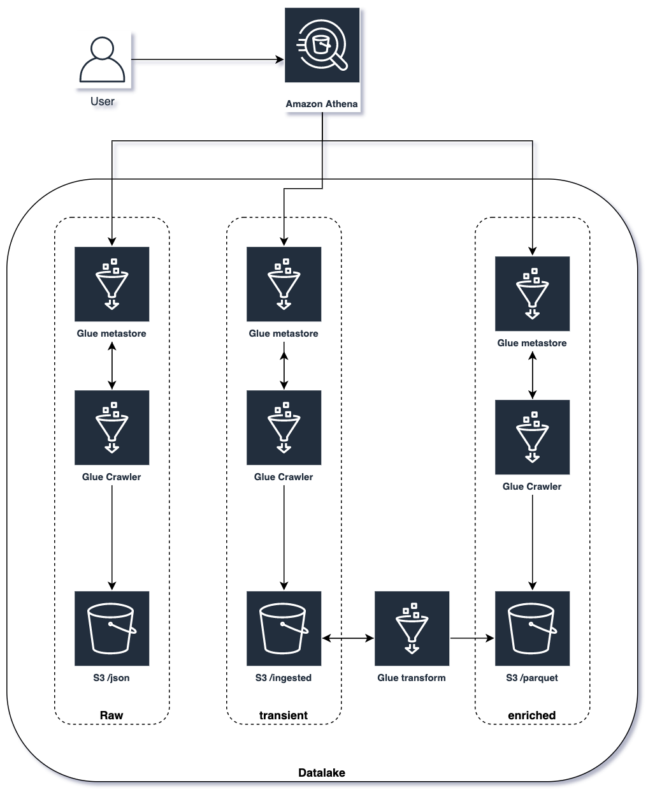

1. Primeiro será necessário criar os crawlers do glue, para isso vá para a console do serviço `Glue` e clique em `Crawlers` na lateral esquerda.
   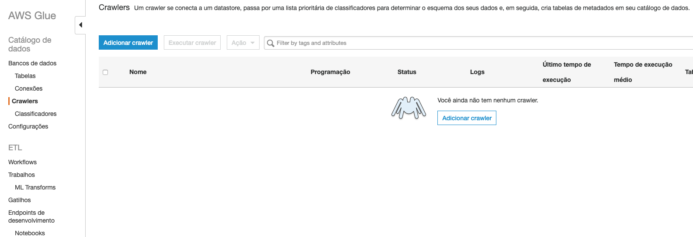
2. Clique em `Adicionar crawler`
3. Coloque o nome de `json` e clique em 'Próximo'
   
4. Escolha `Data stores` e clique em 'Próximo'
   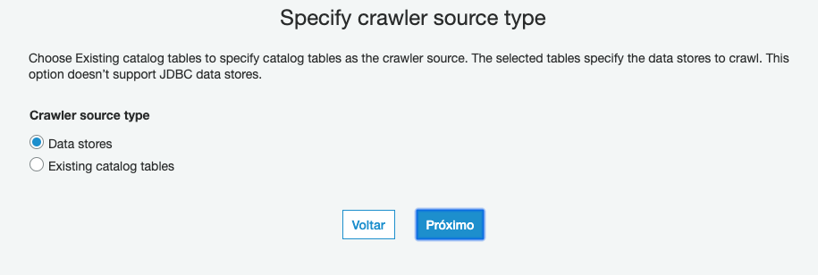
5. Clique no icone da pasta ao lado do campo texto de `Incluir caminho`. Expanda as pastas do seu bucket e selecione `json`. Clique em `Selecionar` e `Próximo`
   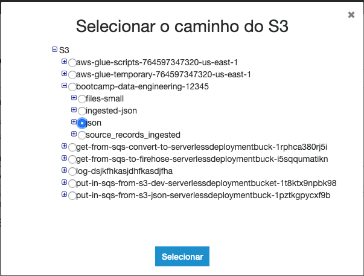
6. Deixe o `Não` selecionado e clique em próximo.
7. Complete o nome do função IAM com `json-crawler` e clique em 'Próximo'
   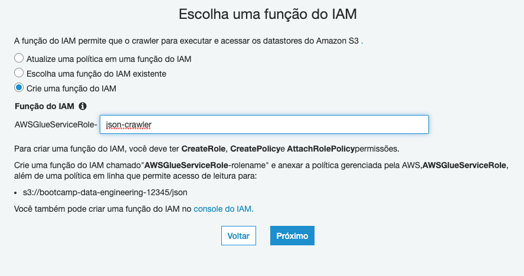
8. Deixe em `Executar sobre demanda` e clique em 'Próximo'
9. Clique em `Adicionar banco de dados` e de o nome de `bootcamp`. Clique em 'Criar' e 'Próximo'
    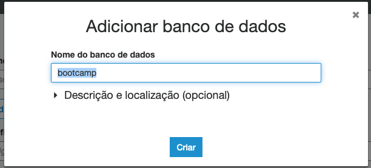
10. Revise e clique em `Concluir`
11. Devolta a tela principal dos crawlers você irá ver uma mensagem oferecendo executar o recém criado crawler. Clique em `Executar agora?`
    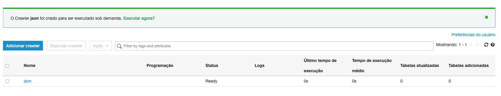
12. Enquanto o crawler executa vamos criar outro. Clique em `Adicionar crawler`
13. De o nome de `ingested-json`, no camonho do S3 escolha a pasta `ingested-json`, na funcão complete com `ingested-json-crawler` e por fim escolha o banco de dados `bootcamp` que criou nos passos anteriores.
    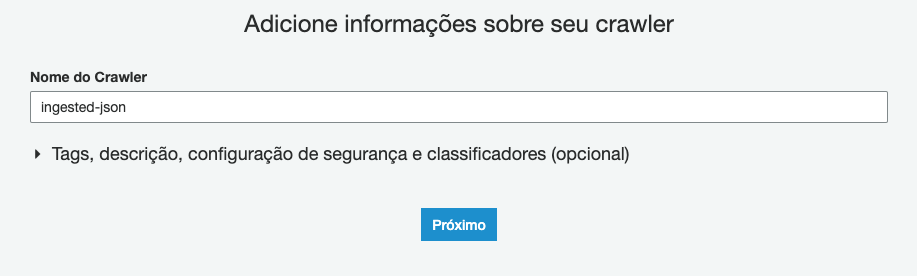
    
    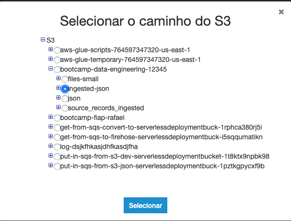

    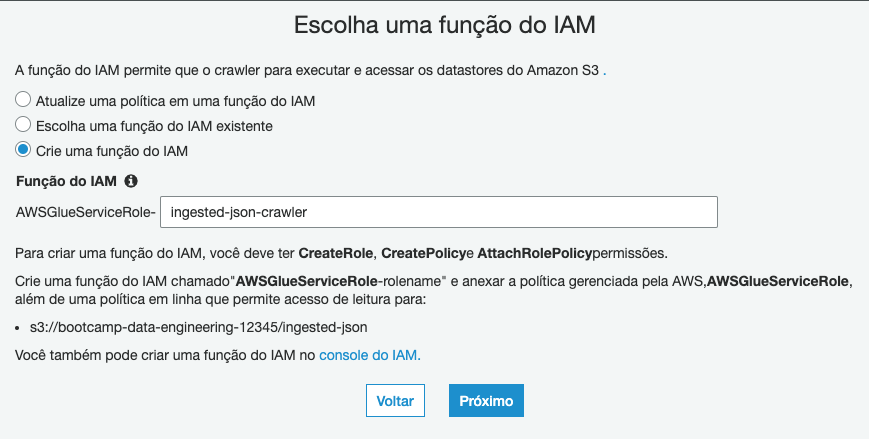

14. Após a criação execute o crawler como fez antes.
    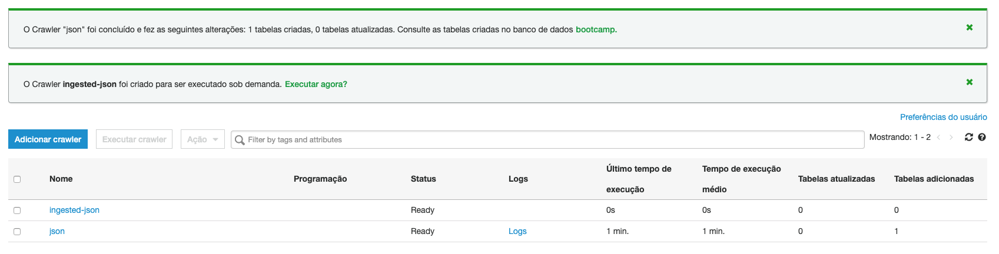
15. Aguarde os 2 crawlers voltarem ao estado ready como na imagem.
    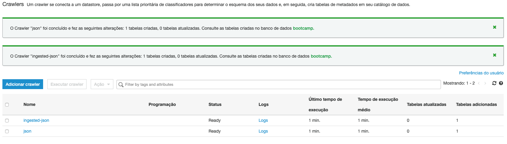
16. Abra em outra aba o serviço `Athena`
17. Antes de qualquer coisa precisamos configurar onde serão salvas as querys executadas no Athena. No canto superior direito clique em `Settings`. Preencha com `s3://bootcamp-data-engineering-<SEU RM>/querys-athena/` e clique em 'Save'.
    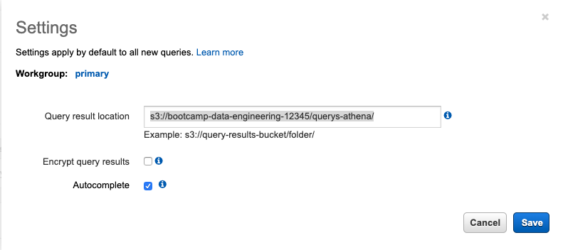
18. Selecione o banco de dados `Bootcamp`
    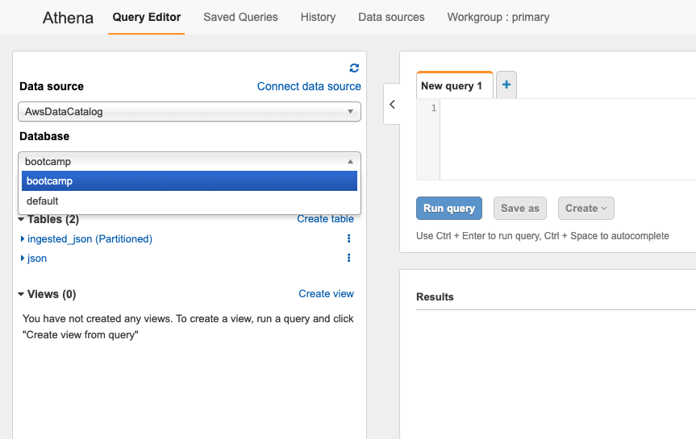
19. Faça o carregamento das partições criadas para a tabela ingested-json. Clique nos 3 pontos ao lado do nome da tabela e selecione `Load partitions`
20. Se clicar nos 3 pontos e selecionar `Preview table` nas 2 tabelas verá uma amostra dos dados das tabelas.
    
21. Ao escolher uma e cliqcar nos 2 pontos selecionando `Generate Create Table DDL` verá o script que o crawler do glue criou para gerar a tabela a partir do S3.
    
22. Se sinta livre para executar queries. Caso fique com alguma dúvida sobre o que é possível fazer, segue a [documentação oficial](https://docs.aws.amazon.com/athena/latest/ug/ddl-sql-reference.html)
23. De volta ao Glue, vamos fazer a conversão dos arquivos Json para [parquet](https://parquet.apache.org/documentation/latest/) para que o tamanho diminua e as queries e pesquisas fiquem otimizadas utilizando o Athena. Para isso no menu lateral clique em `Trabalhos`
    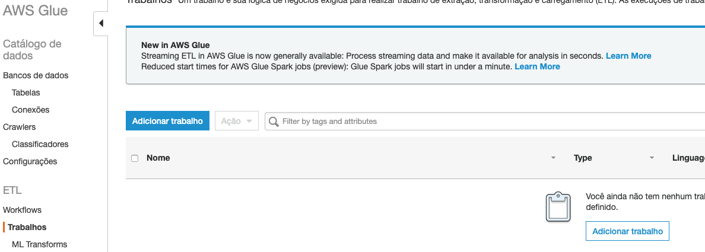
24. Clique em `Adicionar trabalho`
25. De o nome de `transform-to-parquet`
26. No campo `Função do IAM` clique em `Criar função do IAM.` no texto abaixo. Isso vai abrir uma nova aba em IAM para criarmos a função que será usada pelo Glue Job.
27. Clique em `Criar função`
28. Selecione o `Glue` na lista de serviços e clique em `Próximo: Permissões`
    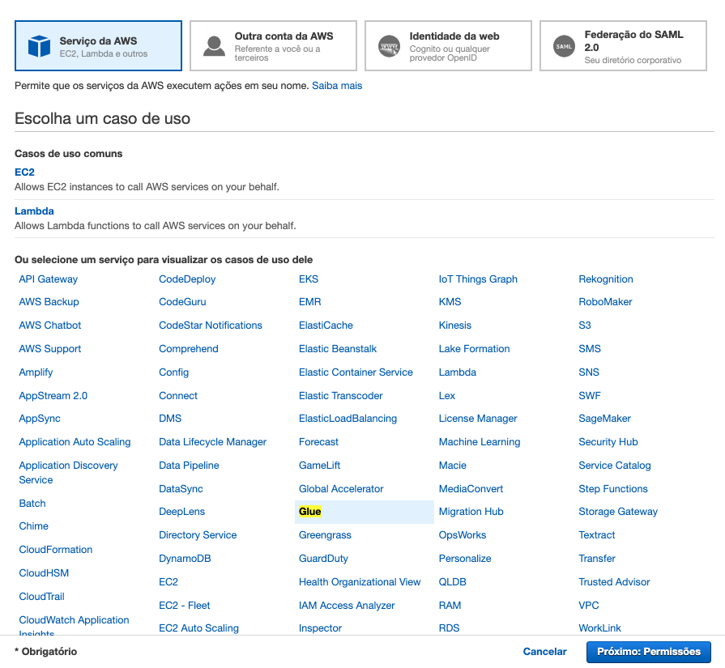
29. Para fins de demo, selecione `AdministratorAccess` e clique em `Próximo: Tags`. Sempre bom lembrar que quando for implantar em um ambiente real é necessário fazer as permissões mais restritivas possiveis.
30. Clique em `Próximo: Revisar`
31. Coloque o nome `glue-job-transform-to-parquet` e clique em `Criar função`.
32. De volta a tela de criação de trabalho do Glue clique no icone de atualização das funções IAM e selecione a recém criada `glue-job-transform-to-parquet`.
    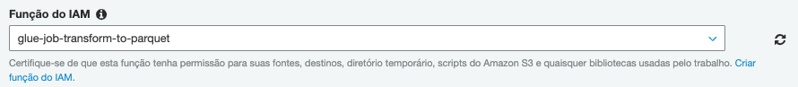
33. Em propriedades avançadas marque `Habilitar` em `Marcador de trabalho`. Em Monitoring options marque `Métricas do trabalho` e `Continuous logging`.
    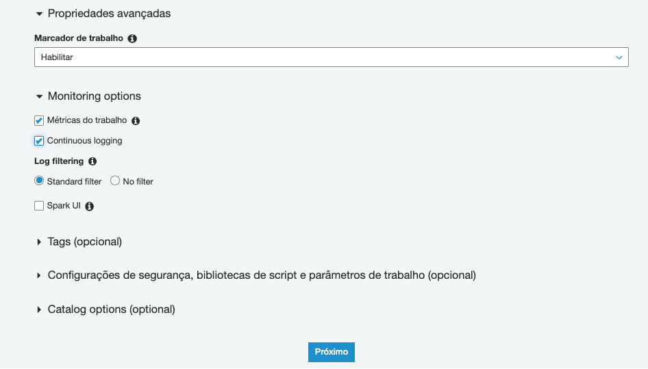
34. Clique em `Próximo`
35. Escolha a fonte de dados `ingested_json` e clique em `Próximo`
36. Mantenha `Change schema` selecionado e clique em `Próximo`
37. Selecione `Criar tabelas em seu destino de dados` e deixe como na imagem. Importante: a pasta parquet ainda não existe em seu bucket, apenas selecione seu bucket e digite `/parquet`.
    
    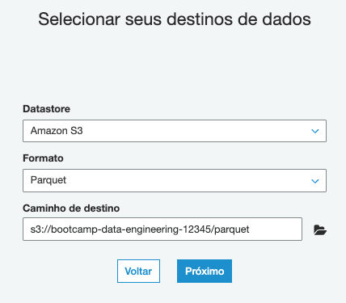
38. Clique em `Próximo`
39. Clique em `Salvar trabalho e editar script`.
40. Nessa tela você pode avaliar o script pyspark criado automaticamente e alterar caso queira. 
    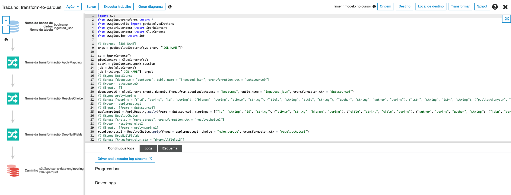
41. Clique em `Executar trabalho` no topo esquerdo da página. O procedimento pode levar até 15 minutos.
42. Clique no `X` no canto direito superior.
43. Selecione o trabalho criado e poderá acompanhar o estágio dele pela aba histórico
    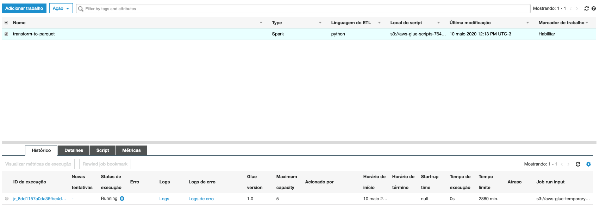
44. Aguarde até que o job fique com o status `Succeeded` 
    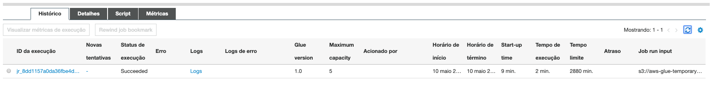
45. Crie um crawler com o nome `parquet` apontando para a nova pasta criada no seu bucket e o execute.
    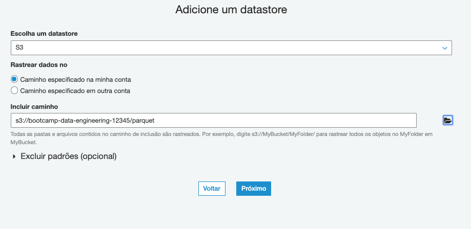
46. Após o novo crawler executar volte para a aba do Athena e atualize as tabelas. Verá que uma nova tabela esta disponivel. Tabela `parquet`.
    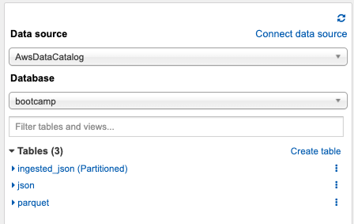
47. Execute o preview da tabela. 
    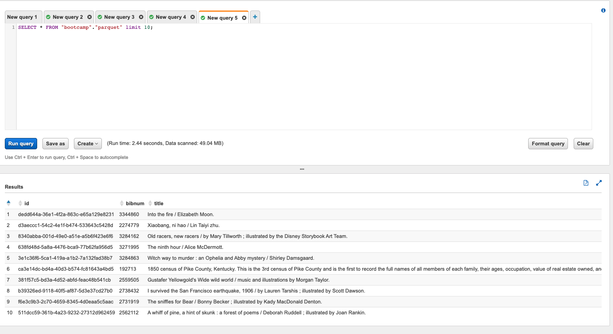
48. Execute as querys abaixo contando os elementos entre o Raw(Json) e o Enriched(Parquet) e os números vão bater. Note porém que a query do parquet roda mais rapido e com menos Gbs movimentados.
    ```
        SELECT count(*) FROM "bootcamp"."json";
        SELECT count(*) FROM "bootcamp"."parquet";
    ```
 49. FINAL DO BOOTCAMP \0/ 
    
   

